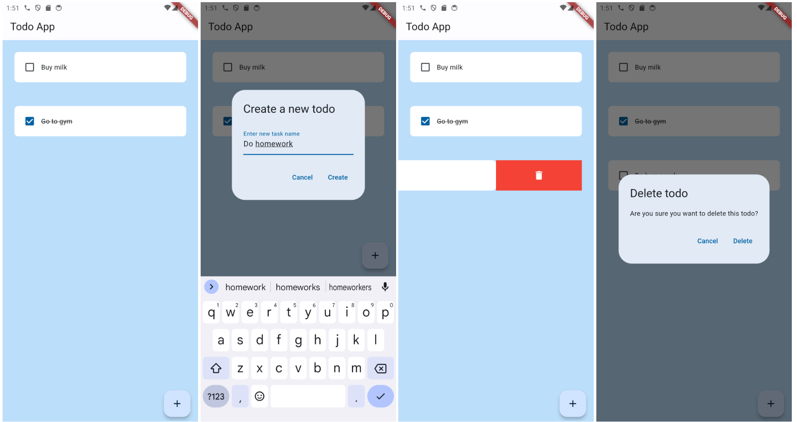

# Flutter Todo App

Simple todo app built with Flutter.

## Features

- Create, delete and mark todos as completed.


## Screenshots



## Installation

To run this project locally, follow these steps:

1. Clone this repository to your local machine:

   ```bash
   git clone https://github.com/taham8875/flutter-todo-app.git
   ```

2. Navigate to the project directory:

   ```bash
   cd flutter-todo-app
   ```

3. Ensure you have Flutter installed. If not, follow the [official Flutter installation guide](https://flutter.dev/docs/get-started/install).

4. Run the app on your preferred device or emulator:

   ```bash
   flutter run
   ```